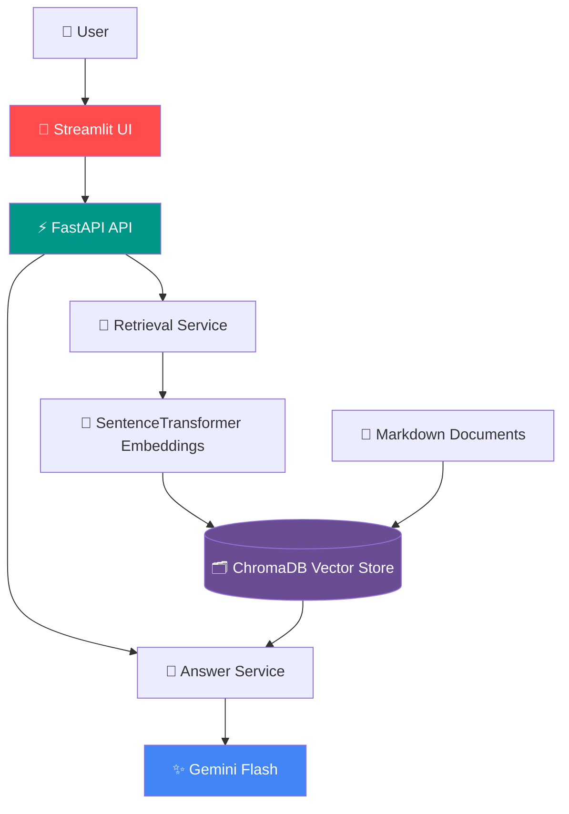
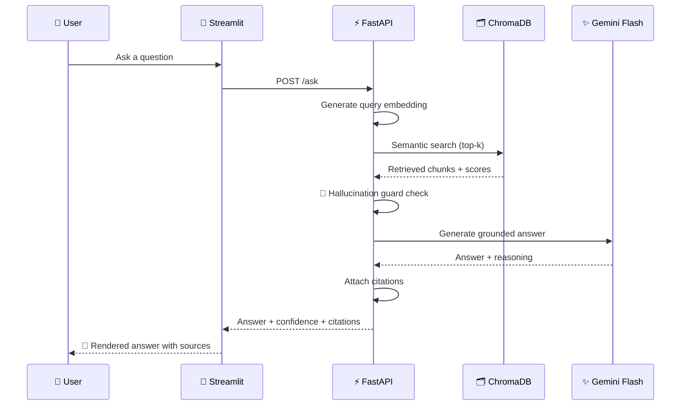

<div align="center">

# 📄 Document Q&A with Citations

### 🔍 A Retrieval-Augmented Generation (RAG) system that answers questions from your documents — grounded, cited, and hallucination-free.

**Built for the Potens AI/ML Internship Assignment**

<br/>


<br/>

[🚀 Quick Start](#-installation) • [🏗 Architecture](#-architecture) • [🖥 API](#-api-endpoints) • [🧪 Testing](#-testing) • [📸 Demo](#-screenshots) • [👨‍💻 Author](#-author)

</div>

---

## 🎯 Why This Project

Most chatbots guess. This one **doesn't**.

Instead of asking an LLM to answer from memory, this system retrieves the *actual* relevant passages from your documents first, then asks Gemini Flash to answer **only** from that evidence — attaching citations to every claim and **refusing to answer** when the evidence isn't strong enough.

| ❌ Typical LLM Chatbot | ✅ This System |
|---|---|
| Answers from memory, may hallucinate | Answers only from retrieved evidence |
| No source attribution | Every answer includes citations |
| Confidently wrong | Refuses when confidence is low |
| English-only, often | Multilingual query support |
| Black box | Retrieved-evidence panel for full transparency |

---

## ✨ Features

<table>
<tr>
<td width="50%" valign="top">

**🧠 Core Intelligence**
- 🔎 Retrieval-Augmented Generation (RAG)
- 🚫 Hallucination Guard
- 📚 Automatic Source Citations
- 🌐 Multilingual Query Support
- 📊 Confidence Scoring

</td>
<td width="50%" valign="top">

**⚙️ Engineering**
- ⚡ FastAPI REST Backend
- 🎨 Streamlit Frontend
- 🗂️ ChromaDB Vector Search
- 🧬 SentenceTransformer Embeddings
- 🧩 Modular Provider Architecture
- 💉 Dependency Injection
- 🐳 Docker Ready

</td>
</tr>
</table>

---

## 🏗 Architecture

Clean, layered, and framework-free — no LangChain, no LlamaIndex. Every layer has one job.



**Design principle:** UI → API → Services → Providers → External systems. The UI never talks to Chroma or Gemini directly.

---

## ⚙️ Tech Stack

| Layer | Technology | Purpose |
|---|---|---|
| 🎨 Frontend | Streamlit | Interactive Q&A interface |
| ⚡ Backend | FastAPI | REST API layer |
| 🧠 LLM | Google Gemini Flash | Grounded answer generation |
| 🧬 Embeddings | SentenceTransformers (`multilingual-e5-base`) | Semantic search |
| 🗂️ Vector Database | ChromaDB | Chunk storage & similarity search |
| ⚙️ Configuration | pydantic-settings | Typed, validated config |
| 📄 Parsing | PyMuPDF | Document ingestion |
| 🧪 Testing | Pytest | Automated test suite |
| 🐳 Containerization | Docker | Reproducible deployment |

---

## 📂 Project Structure

```text
potens-intern-aiml-piyush-pawar/
│
├── app/
│   ├── api/          🌐 Route definitions (orchestration only)
│   ├── config/        ⚙️  Settings & environment config
│   ├── models/        📦 Pydantic schemas
│   ├── providers/     🔌 Thin wrappers around Gemini / Chroma SDKs
│   ├── services/      🧠 Business logic (retrieval, answering, guards)
│   ├── ui/            🎨 Streamlit frontend
│   └── main.py         🚀 FastAPI entrypoint
│
├── chroma_db/          🗂️ Persisted vector store
├── documents/          📄 Source markdown corpus
├── prompts/            📝 Prompt templates
├── tests/              🧪 Pytest suite
│
├── Dockerfile
├── docker-compose.yml
├── requirements.txt
├── pytest.ini
└── README.md
```

---

## 🔄 How a Question Gets Answered



---

## 🖥 API Endpoints

| Method | Endpoint | Description |
|---|---|---|
| 🟢 `GET` | `/health` | Health check + index stats |
| 🔵 `POST` | `/ask` | Ask a grounded question |
| 🟣 `POST` | `/contradict` | Detect contradictions across documents |

---

## 📦 Installation

```bash
# 1️⃣ Clone the repository
git clone https://github.com/pentiumcoder/potens-intern-aiml-piyush-pawar.git
cd potens-intern-aiml-piyush-pawar

# 2️⃣ Create a virtual environment
python -m venv .venv
.venv\Scripts\activate        # Windows
# source .venv/bin/activate   # macOS / Linux

# 3️⃣ Install dependencies
pip install -r requirements.txt
```

---

## 🔑 Environment Variables

Create a `.env` file in the project root:

```env
APP_ENV=development
APP_HOST=0.0.0.0
APP_PORT=8000

GEMINI_API_KEY=YOUR_API_KEY
GEMINI_MODEL=gemini-2.5-flash

EMBEDDING_MODEL=intfloat/multilingual-e5-base

VECTOR_DB_PATH=./chroma_db
DOCUMENTS_DIR=./documents

LOG_LEVEL=INFO
```

---

## ▶️ Running the Application

**Backend**
```bash
uvicorn app.main:app --reload
```
📘 Swagger docs → `http://127.0.0.1:8000/docs`

**Frontend**
```bash
streamlit run app/ui/streamlit_app.py
```

---

## 🧪 Example Request

```json
{
  "question": "What is FastAPI?",
  "top_k": 3,
  "response_language": "English"
}
```

## 📤 Example Response

```json
{
  "answer": "...",
  "confidence": 0.91,
  "refused": false,
  "citations": [
    {
      "document": "introduction.md",
      "section": "Overview"
    }
  ]
}
```

---

## 🛡 Design Principles

<table>
<tr>
<td>🧩 Provider Pattern</td>
<td>💉 Dependency Injection</td>
<td>🧠 Service Layer Architecture</td>
</tr>
<tr>
<td>🐢 Lazy Initialization</td>
<td>🔀 Separation of Concerns</td>
<td>📝 Prompt Templates</td>
</tr>
<tr>
<td>🚫 Hallucination Prevention</td>
<td>🧱 Modular Components</td>
<td>🔒 No Framework Lock-in</td>
</tr>
</table>

---

## 🧪 Testing

```bash
pytest
```

✅ 17 tests passing across ingestion, retrieval, generation, and API layers.

---

## 🐳 Docker

```bash
# Build the image
docker build -t document-qa .

# Run the container
docker run -p 8000:8000 document-qa
```

---

## 📈 Roadmap

- [ ] 📑 PDF & DOCX ingestion
- [ ] 🔀 Hybrid Search (BM25 + Dense Retrieval)
- [ ] 📡 Response Streaming
- [ ] 💬 Conversation Memory
- [ ] 🔐 Authentication
- [ ] 👀 Automatic Document Monitoring
- [ ] 🎯 Re-ranking Models

---

## 📸 Screenshots

> Add screenshots before submission — placeholders below.

| Streamlit UI | Swagger API |
|---|---|
| |
| |
 

---

## 👨‍💻 Author

<div align="center">

**Piyush Suresh Pawar**

[](https://github.com/pentiumcoder)
[](https://www.linkedin.com/in/piyush-pawar-61849a283)

</div>

---

## 🙏 Acknowledgements

Potens AI/ML Internship Program • FastAPI • ChromaDB • SentenceTransformers • Google Gemini API • Streamlit

<div align="center">

⭐ **If this project is useful or interesting, consider giving it a star!** ⭐

</div>
